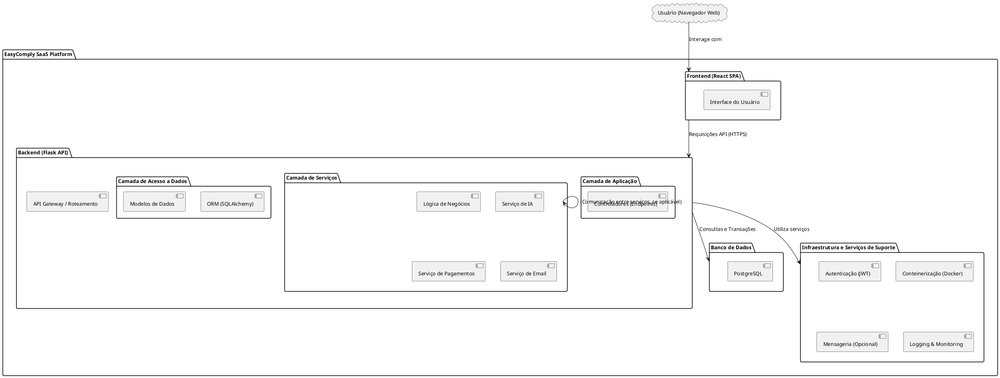
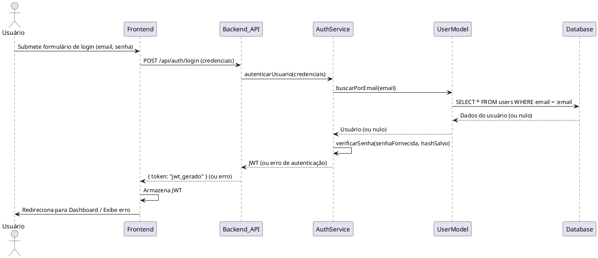

# Documento de Arquitetura – EasyComply

**Versão:** 1.0
**Data:** 15 de Maio de 2025

---

## 1. Introdução

### 1.1. Propósito do Documento
Este documento descreve a arquitetura de software do sistema EasyComply, detalhando seus principais componentes, as interações entre eles, os fluxos de dados e as decisões arquiteturais tomadas. O objetivo é fornecer uma visão clara e aprofundada para desenvolvedores, arquitetos e outras partes interessadas no projeto.

### 1.2. Escopo do Sistema
O EasyComply é uma solução SaaS (Software as a Service) projetada para auxiliar pequenas e médias empresas a alcançarem e manterem a conformidade com a Lei Geral de Proteção de Dados (LGPD) e outras boas práticas de segurança da informação. As funcionalidades principais incluem checklist inteligente, geração de documentos legais, simulação de auditorias, consultoria com IA, treinamentos gamificados, painéis analíticos e gestão de incidentes.

### 1.3. Objetivos da Arquitetura
Os principais objetivos que nortearam o desenho da arquitetura do EasyComply são:
*   **Modularidade:** Facilitar a manutenção, evolução e o desenvolvimento paralelo de diferentes partes do sistema.
*   **Escalabilidade:** Permitir que o sistema cresça para atender a um número crescente de usuários e dados.
*   **Segurança:** Garantir a proteção dos dados dos usuários e da plataforma, especialmente em conformidade com a LGPD.
*   **Manutenibilidade:** Adotar padrões e tecnologias que facilitem a compreensão e modificação do código.
*   **Desempenho:** Oferecer uma experiência de usuário responsiva e eficiente.
*   **Flexibilidade:** Permitir a integração com outros sistemas e a adaptação a futuras necessidades.

### 1.4. Definições, Acrônimos e Abreviações
*   **LGPD:** Lei Geral de Proteção de Dados (Lei nº 13.709/2018).
*   **SaaS:** Software as a Service.
*   **API:** Application Programming Interface.
*   **MVC:** Model-View-Controller.
*   **ORM:** Object-Relational Mapper.
*   **JWT:** JSON Web Token.
*   **IA:** Inteligência Artificial.
*   **ANPD:** Autoridade Nacional de Proteção de Dados.
*   **PME:** Pequena e Média Empresa.

### 1.5. Referências
*   README.md do Projeto EasyComply
*   Lei Geral de Proteção de Dados (LGPD)
*   Documentação oficial do Flask, React, SQLAlchemy, PostgreSQL, Docker.

---

## 2. Visão Geral da Arquitetura

### 2.1. Estilo Arquitetural
O EasyComply adota uma arquitetura de microsserviços distribuídos (ou uma arquitetura monolítica modular com forte separação de componentes, dependendo da escala e evolução), com uma separação clara entre o frontend (aplicação cliente) e o backend (serviços da API). O backend segue princípios inspirados no padrão Model-View-Controller (MVC), adaptado para uma API RESTful, com uma camada de serviços para a lógica de negócios.

### 2.2. Principais Camadas e Componentes
O sistema é dividido nas seguintes camadas principais:

*   **Camada de Apresentação (Frontend):** Interface com o usuário, construída em React.
*   **Camada de Aplicação/API (Backend):** Endpoints da API, orquestração de serviços, construída em Flask.
*   **Camada de Serviços (Backend):** Lógica de negócios principal, desacoplada dos controladores.
*   **Camada de Acesso a Dados (Backend):** Interação com o banco de dados, utilizando SQLAlchemy como ORM.
*   **Camada de Persistência (Banco de Dados):** Armazenamento dos dados, utilizando PostgreSQL.
*   **Camada de Inteligência Artificial:** Componentes e serviços relacionados à IA (Gemini 1.5 Pro).

### 2.3. Diagrama de Arquitetura de Alto Nível
*(Placeholder para um diagrama de alto nível mostrando as principais camadas e suas interações. Este diagrama pode ser gerado usando PlantUML ou outra ferramenta e inserido aqui.)*

---

## 3. Arquitetura do Backend (Flask)

### 3.1. Visão Geral
O backend é uma aplicação Flask que expõe uma API RESTful para o frontend e potenciais integrações de terceiros. Ele é responsável pela lógica de negócios, gerenciamento de dados e autenticação.

### 3.2. Estrutura de Diretórios (Detalhada)
(Conforme descrito no README.md, seção "Estrutura do Projeto")

### 3.3. Componentes Principais

#### 3.3.1. `app/__init__.py` e `config.py`
*   **`__init__.py`:** Ponto de entrada da aplicação Flask. Responsável por criar a instância da aplicação, registrar blueprints, inicializar extensões e carregar configurações.
*   **`config.py`:** Define diferentes classes de configuração (Desenvolvimento, Testes, Produção) para variáveis como strings de conexão com o banco de dados, chaves secretas (JWT, Flask), configurações de email, etc. As configurações são carregadas a partir de variáveis de ambiente (gerenciadas pelo `.env`).

#### 3.3.2. `extensions.py`
Centraliza a inicialização de extensões Flask para evitar importações circulares e organizar o código. Exemplos:
*   `db = SQLAlchemy()`
*   `migrate = Migrate()`
*   `jwt = JWTManager()`
*   `login_manager = LoginManager()` (Se utilizar sessões Flask para alguma parte administrativa, caso contrário, focar em JWT para a API)

#### 3.3.3. Controladores (`app/controllers/`)
*   Responsáveis por receber as requisições HTTP das rotas, validar entradas (frequentemente delegando aos schemas), interagir com a camada de serviços para executar a lógica de negócios e preparar as respostas HTTP (geralmente em JSON).
*   Cada controlador agrupa funcionalidades relacionadas (ex: `auth_controller.py` para autenticação, `checklist_controller.py` para funcionalidades do checklist).

#### 3.3.4. Modelos (`app/models/`)
*   Definem a estrutura das tabelas do banco de dados usando classes Python e o ORM SQLAlchemy.
*   Incluem definições de colunas, tipos de dados, relacionamentos entre tabelas (one-to-many, many-to-many) e, opcionalmente, métodos auxiliares para manipulação de dados específicos do modelo.

#### 3.3.5. Rotas (`app/routes/` ou definido nos Blueprints dos Controllers)
*   Mapeiam URLs e métodos HTTP para funções específicas nos controladores.
*   O uso de Flask Blueprints é recomendado para modularizar as rotas por funcionalidade (ex: um blueprint para autenticação, outro para checklists, etc.).

#### 3.3.6. Camada de Serviços (`app/services/`)
*   Contém a lógica de negócios principal da aplicação, desacoplada dos controladores.
*   Os serviços são chamados pelos controladores e podem interagir com múltiplos modelos ou outros serviços.
*   Exemplos: `ia_service.py` (lógica de interação com o modelo Gemini, processamento de consultas), `payment_service.py` (integração com gateways de pagamento), `incident_service.py` (orquestração do fluxo de gestão de incidentes).

#### 3.3.7. Schemas (`app/schemas/`)
*   Utilizados para validação dos dados de entrada das requisições (payloads JSON) e para serialização dos dados de saída (objetos do ORM para JSON).
*   Bibliotecas como Marshmallow são comumente usadas para este fim.

#### 3.3.8. Utilitários (`app/utils/`)
*   Módulos com funções auxiliares genéricas, como validadores customizados, formatadores de dados, decoradores (ex: para checagem de permissões baseadas em roles JWT, logging de requisições).

#### 3.3.9. Templates e Arquivos Estáticos (`app/templates/`, `app/static/`)
*   Embora o foco principal seja uma API para o frontend React, podem existir templates para funcionalidades específicas (ex: emails HTML, páginas de administração simples, ou se alguma parte for renderizada no servidor).
*   Arquivos estáticos servidos diretamente pelo Flask (em desenvolvimento) ou por um servidor web como Nginx (em produção).

### 3.4. Fluxo de Requisição Típico (Backend)
1.  Uma requisição HTTP chega ao servidor (Nginx em produção, servidor de desenvolvimento Flask localmente).
2.  Nginx (se usado) pode realizar balanceamento de carga ou servir arquivos estáticos, e então encaminha a requisição para a aplicação Flask (WSGI server como Gunicorn/uWSGI).
3.  O Flask recebe a requisição e, através do sistema de roteamento (Blueprints), direciona para o `controller` apropriado.
4.  O `controller` pode usar um `schema` para validar os dados da requisição.
5.  O `controller` chama um ou mais métodos na `camada de serviço` para executar a lógica de negócio.
6.  A `camada de serviço` interage com os `modelos` (SQLAlchemy) para buscar ou persistir dados no PostgreSQL.
7.  Os `modelos` traduzem as operações em consultas SQL e interagem com o banco de dados.
8.  Os resultados são retornados para a `camada de serviço`, depois para o `controller`.
9.  O `controller` usa um `schema` para serializar os dados de resposta em JSON.
10. O Flask envia a resposta HTTP (com status code e corpo JSON) de volta ao cliente.

### 3.5. Autenticação e Autorização
*   **Autenticação:** Utiliza JSON Web Tokens (JWT). O cliente envia credenciais (usuário/senha), o `auth_controller` valida e, se bem-sucedido, gera um JWT que é retornado ao cliente. O cliente deve incluir este JWT no header `Authorization` (Bearer Token) em requisições subsequentes a rotas protegidas.
*   **Autorização:** Pode ser implementada com decoradores que verificam as `claims` (informações, como roles ou permissões) dentro do JWT para permitir ou negar acesso a determinados recursos ou operações.

---

## 4. Arquitetura do Frontend (React)

### 4.1. Visão Geral
O frontend é uma Single Page Application (SPA) construída com React. Ele é responsável por toda a interface do usuário, interações e comunicação com a API do backend.

### 4.2. Estrutura de Diretórios (Detalhada)
(Conforme descrito no README.md, seção "Estrutura do Projeto")

### 4.3. Componentes Principais

#### 4.3.1. `src/components/`
*   Contém componentes React reutilizáveis e de apresentação (dumb components), como botões, inputs, cards, tabelas, modais, gráficos, etc. Devem ser genéricos e customizáveis via props.

#### 4.3.2. `src/pages/` (ou `src/views/`, `src/containers/`)
*   Componentes que representam as diferentes telas ou seções principais da aplicação (smart components).
*   São responsáveis por buscar dados dos serviços, gerenciar estado específico da página e compor a UI utilizando os componentes reutilizáveis.

#### 4.3.3. `src/contexts/`
*   Utiliza a Context API do React para gerenciamento de estado global ou compartilhado entre múltiplos componentes, como informações de autenticação do usuário, tema da aplicação, configurações globais do usuário, etc.

#### 4.3.4. `src/hooks/`
*   Hooks personalizados para encapsular lógica reutilizável com estado e efeitos colaterais, como `useAuth` (para interagir com o AuthContext), `useApi` (para chamadas à API com tratamento de loading/erro), `useForm` (para gerenciamento de formulários).

#### 4.3.5. `src/services/` (ou `src/api/`)
*   Módulos responsáveis por encapsular a lógica de comunicação com a API do backend.
*   Utilizam bibliotecas como `axios` ou `fetch` para realizar as requisições HTTP, tratar respostas e erros.
*   Exemplo: `authService.js`, `checklistService.js`.

#### 4.3.6. `src/styles/`
*   Arquivos de estilização global (ex: `global.css`), variáveis CSS (ou SASS/LESS), definições de tema, e estilos específicos para componentes que não são facilmente gerenciados com CSS-in-JS ou CSS Modules se essa for a abordagem.

#### 4.3.7. `src/App.js` e `src/index.js`
*   **`index.js`:** Ponto de entrada da aplicação React, renderiza o componente `App` no DOM.
*   **`App.js`:** Componente raiz que geralmente configura o roteamento principal da aplicação (usando `react-router-dom`), provedores de contexto globais e layouts base.

#### 4.3.8. Roteamento
*   Utiliza `react-router-dom` para gerenciar a navegação entre as diferentes páginas da SPA, permitindo URLs limpas e navegação baseada no histórico do navegador.

### 4.4. Gerenciamento de Estado
*   **Estado Local:** Componentes utilizam `useState` e `useReducer` para gerenciar seu próprio estado.
*   **Estado Compartilhado/Global:** React Context API é a escolha primária. Para aplicações mais complexas, bibliotecas como Redux, Zustand ou Jotai poderiam ser consideradas, mas a Context API com `useReducer` é poderosa para muitos casos.

### 4.5. Comunicação com o Backend
*   Todas as interações com o backend são feitas através de requisições HTTP (principalmente GET, POST, PUT, DELETE) para a API RESTful do Flask.
*   O JWT recebido após o login é armazenado de forma segura (ex: `localStorage` ou `sessionStorage`, com considerações de segurança, ou em memória com contextos) e enviado no header `Authorization` de cada requisição protegida.

---

## 5. Fluxos de Dados Principais

### 5.1. Fluxo de Autenticação de Usuário
1.  **Usuário (Frontend):** Insere email e senha no formulário de login.
2.  **Frontend (`AuthPage`, `authService`):** Envia uma requisição POST para `/api/auth/login` no backend com as credenciais.
3.  **Backend (`auth_controller`):** Valida as credenciais contra o banco de dados (via `userService` e `User` model).
4.  **Backend:** Se válido, gera um JWT contendo `user_id` e `roles`.
5.  **Backend:** Retorna o JWT no corpo da resposta JSON.
6.  **Frontend (`authService`, `AuthContext`):** Armazena o JWT (ex: localStorage) e atualiza o estado de autenticação global.
7.  **Frontend:** Redireciona o usuário para o dashboard ou página principal.
8.  **Requisições Subsequentes (Frontend):** Para rotas protegidas, o JWT é incluído no header `Authorization: Bearer <token>`.
9.  **Backend (Decorador `@jwt_required`):** Valida o JWT. Se válido, permite o acesso ao recurso; caso contrário, retorna erro 401.

### 5.2. Fluxo de Criação de um Novo Checklist
1.  **Usuário (Frontend):** Preenche o formulário para criar um novo checklist (título, descrição, itens).
2.  **Frontend (`ChecklistPage`, `checklistService`):** Envia uma requisição POST para `/api/checklists` com os dados do novo checklist.
3.  **Backend (`checklist_controller`):** Valida os dados de entrada (usando `ChecklistSchema`).
4.  **Backend (`checklist_controller`):** Chama o `checklist_service` para criar o checklist.
5.  **Backend (`checklist_service`):** Cria uma nova instância do modelo `Checklist` e a salva no banco de dados via SQLAlchemy.
6.  **Backend:** Retorna uma resposta JSON com o checklist criado (ou status de sucesso).
7.  **Frontend (`checklistService`):** Recebe a resposta, atualiza o estado local/global (ex: adiciona o novo checklist à lista) e exibe uma notificação de sucesso.

### 5.3. Fluxo de Consulta à IA
1.  **Usuário (Frontend):** Digita uma pergunta ou envia um documento para análise na interface de consultoria com IA.
2.  **Frontend (`IAPage`, `iaService`):** Envia uma requisição POST para `/api/ia/consult` com a query do usuário (e/ou o documento).
3.  **Backend (`ia_controller`):** Recebe a requisição.
4.  **Backend (`ia_controller`):** Chama o `ia_service` para processar a consulta.
5.  **Backend (`ia_service`):**
    *   Pré-processa a query/documento.
    *   Interage com o modelo Gemini 1.5 Pro (potencialmente via API externa ou biblioteca cliente).
    *   Pode utilizar embeddings locais para buscar informações relevantes em uma base de conhecimento vetorizada (documentos da LGPD, normas, etc.) para fornecer contexto ao Gemini.
    *   Pós-processa a resposta do modelo.
6.  **Backend:** Retorna a resposta da IA em formato JSON.
7.  **Frontend (`iaService`):** Recebe a resposta e a exibe na interface para o usuário.

*(Outros fluxos importantes podem ser detalhados aqui, como Geração de Documentos, Gestão de Incidentes, etc.)*

---

## 6. Persistência de Dados (PostgreSQL)

### 6.1. Modelo de Dados Entidade-Relacionamento (MER)
*(Placeholder para um diagrama MER ou descrição das principais entidades e seus relacionamentos.)*
Principais Entidades:
*   `User` (usuários da plataforma, empresas clientes)
*   `Checklist` (modelos de checklist e checklists preenchidos por usuários)
*   `ChecklistItem`
*   `Documento` (documentos legais gerados, políticas)
*   `Auditoria` (simulações de auditoria, resultados)
*   `Treinamento` (módulos de treinamento, progresso do usuário)
*   `Incidente` (registros de incidentes de segurança)
*   `Relatorio` (dados para relatórios de conformidade)
*   Outras tabelas de suporte (roles, permissões, logs, etc.)

### 6.2. Migrações de Banco de Dados
*   Utiliza Flask-Migrate com Alembic para gerenciar as alterações no esquema do banco de dados.
*   Comandos como `flask db migrate` (para gerar um novo script de migração) e `flask db upgrade` (para aplicar as migrações ao banco) são usados durante o desenvolvimento e deploy.

---

## 7. Inteligência Artificial (IA)

### 7.1. Arquitetura do Componente de IA
*   **Modelo Principal:** Gemini 1.5 Pro (ou similar LLM).
*   **Embeddings Locais/Vetoriais:** Para busca de similaridade e contextualização com documentos específicos da LGPD, normas ISO, jurisprudência, e dados da empresa (se permitido e seguro).
*   **`ia_service.py` (Backend):** Orquestra a interação com o LLM, o processamento de embeddings, e a lógica de RAG (Retrieval Augmented Generation) se aplicável.

### 7.2. Fluxo de Treinamento e Inferência
*   **Treinamento/Fine-tuning (se aplicável):** O modelo Gemini é pré-treinado. Fine-tuning específico pode ser considerado para tarefas muito especializadas, mas geralmente a abordagem será de prompt engineering e RAG.
*   **Criação da Base Vetorial:** Documentos relevantes (LGPD, etc.) são processados, divididos em chunks, transformados em embeddings (vetores) e armazenados em um banco de dados vetorial (ex: FAISS, Pinecone, ou mesmo PostgreSQL com pgvector).
*   **Inferência (Consulta do Usuário):**
    1.  A query do usuário é transformada em um embedding.
    2.  Busca por similaridade é realizada na base vetorial para encontrar os chunks de texto mais relevantes.
    3.  Os chunks relevantes são usados para aumentar o prompt enviado ao Gemini, fornecendo contexto.
    4.  Gemini gera a resposta com base no prompt aumentado.

---

## 8. Segurança

### 8.1. Autenticação e Autorização (Revisão)
*   JWT para autenticação stateless da API.
*   HTTPS/TLS para todas as comunicações.
*   Hashing seguro de senhas (ex: bcrypt, Argon2).
*   Controles de acesso baseados em roles (RBAC) para autorização.

### 8.2. Proteção de Dados (LGPD)
*   Criptografia de dados sensíveis em repouso e em trânsito.
*   Anonimização/Pseudonimização onde aplicável.
*   Políticas de retenção de dados.
*   Mecanismos para atender aos direitos dos titulares (acesso, correção, exclusão).
*   Logs de auditoria detalhados.

### 8.3. Segurança da Infraestrutura
*   Configurações seguras de Docker e do servidor de hospedagem.
*   Firewalls, WAF (Web Application Firewall).
*   Atualizações regulares de segurança para todas as dependências e sistemas operacionais.
*   Prevenção contra vulnerabilidades comuns (OWASP Top 10): XSS, SQL Injection, CSRF, etc. (Flask e React oferecem proteções, mas boas práticas de codificação são essenciais).

---

## 9. Considerações de Deploy e Operação

### 9.1. Ambiente de Produção
*   **Backend:** Servidor WSGI (Gunicorn, uWSGI) por trás de um proxy reverso (Nginx).
*   **Frontend:** Arquivos estáticos servidos por Nginx ou CDN.
*   **Banco de Dados:** Instância PostgreSQL gerenciada ou auto-hospedada com backups regulares.
*   **Conteinerização:** Docker e Docker Compose para consistência entre ambientes e facilidade de deploy. Kubernetes pode ser considerado para orquestração em larga escala.

### 9.2. Logging e Monitoramento
*   **Logging:** Logs estruturados da aplicação (Flask e React), logs de acesso (Nginx), logs do banco de dados.
*   **Monitoramento:** Ferramentas para monitorar a saúde da aplicação, desempenho, uso de recursos (ex: Prometheus, Grafana, Sentry, New Relic).

### 9.3. Escalabilidade
*   **Backend:** Pode ser escalado horizontalmente adicionando mais instâncias da aplicação Flask por trás de um load balancer.
*   **Frontend:** Sendo estático, escala bem com CDNs.
*   **Banco de Dados:** Estratégias como réplicas de leitura, sharding (mais complexo) podem ser consideradas para alta carga.
*   **Serviços de IA:** Podem precisar de infraestrutura dedicada ou uso de APIs gerenciadas que escalam automaticamente.

---

## 10. Roadmap e Evolução da Arquitetura

*(Conforme a seção "Roadmap de Expansão" do README.md, mas com foco nas implicações arquiteturais de cada item.)*

*   **Suporte à ISO 27001:** Pode exigir novos modelos, serviços e controladores para gerenciar controles e evidências da ISO 27001.
*   **Integração com Cloud Storage:** Novas interfaces/serviços para interagir com APIs do Google Drive, OneDrive, etc.
*   **Modelo White-Label:** Modificações na arquitetura para suportar theming, customização de domínios e isolamento de dados de clientes (multi-tenancy).
*   **Comunidade e Marketplace:** Potencialmente novos microsserviços ou módulos para fórum, perfis de consultores, etc.

---

## Apêndice A: Diagramas Adicionais

*(Espaço para diagramas de sequência, diagramas de componentes mais detalhados, etc.)*

### Diagrama de Sequência: Autenticação

